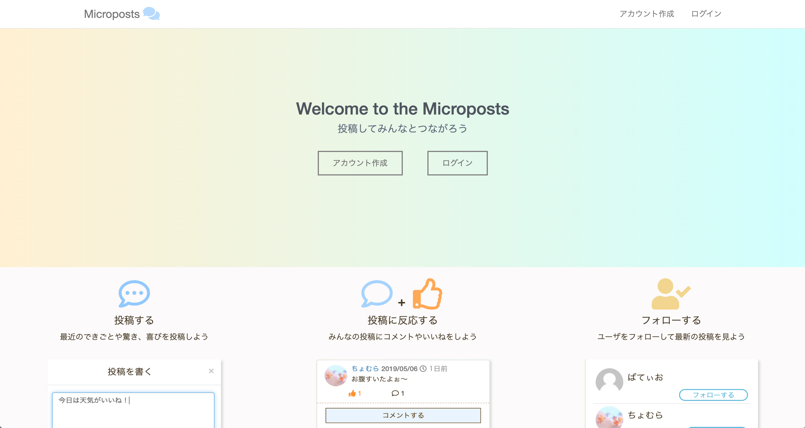
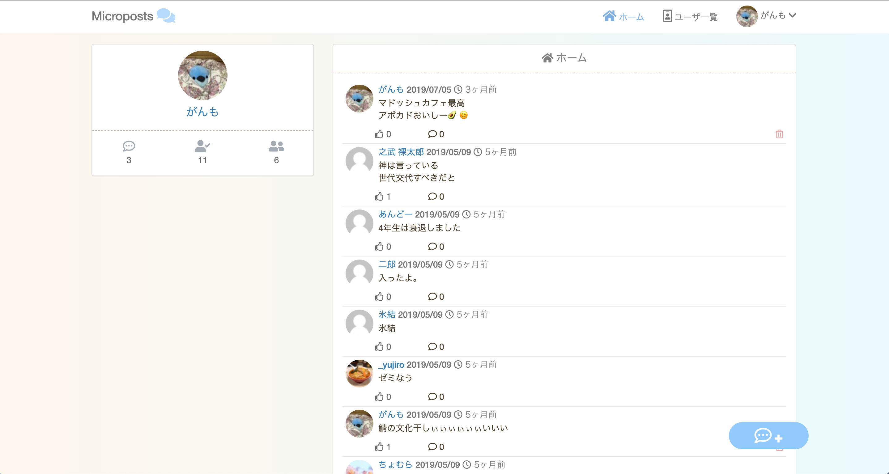
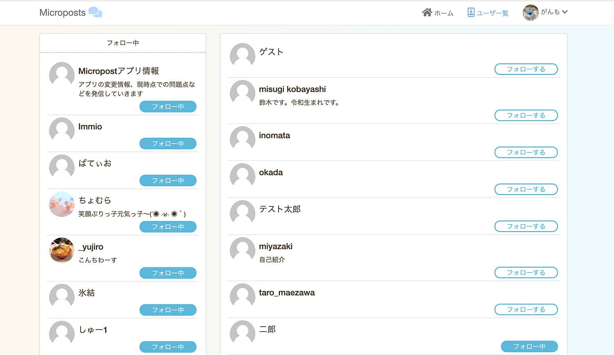

# Twitterクローンアプリ -Micropostsについて

twitterにある機能を自分の力で実装することを目的に作成したアプリです。 

◆herokuでアプリを公開していますhttps://micropost-threehouse.herokuapp.com 
ゲストとしてログインできます 
メールアドレス：guest@guest.guest 
パスワード：guest 

## 使用言語・技術  
Ruby:2.6.2 / Ruby on Rails:5.0.6 / bootstrap / html / css / git  

## 実装機能
実装機能 
・ログイン機能（Cookieとsessionによるログイン） 
・投稿機能(ユーザーとの紐付け） 
・コメント機能 (投稿、ユーザーとの紐付け） 
・いいね機能（中間テーブルの作成、紐付け） 
・いいねの非同期 
・フォロー機能（同じモデル同士で中間テーブルの作成、紐付け） 
・ページネーション(kaminariをカスタマイズ) 
・ゲストログイン（ゲスト権限の設定） 

## アピールポイント
・フォロー機能 
・ページネーションをカスタマイズしたこと 
Qiitaで記事を投稿しています。 
[【Rails初心者】ページネーションを実装して自分好みにデザインを変える](https://qiita.com/rio_threehouse/items/313824b90a31268b0074) 
・ゲストユーザーとしてログインできる 
・エラーメッセージの日本語化 

## 
タイムライン 

ユーザー一覧 
